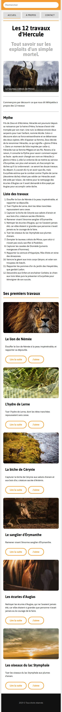

# Les 12 travaux d’Hercule 🏛️

Projet de révision HTML/CSS basé sur une intégration progressive en 12 étapes.  
L’objectif est de corriger, styliser et rendre responsive une page web présentant les 12 travaux d’Hercule, avec des consignes précises à chaque étape.

---

## 🔧 Technologies utilisées

- HTML5
- CSS3 (Flexbox, Grid, Media Queries)
- Google Fonts (Asap)

---

## 📋 Objectifs pédagogiques

- Corriger des erreurs de structure et de liens HTML
- Maîtriser l'intégration CSS : typographie, layout, interactions
- Utiliser `display: grid` pour structurer des articles
- Gérer les effets `hover` avec `transition`
- Travailler un menu fixe en position `fixed`
- Rendre une page entièrement responsive grâce aux `media queries`
- Adapter une navigation selon la taille de l’écran

---

## 🧩 Étapes réalisées

1. Réparation des chemins vers les fichiers (images, CSS)
2. Intégration de la police Asap via Google Fonts
3. Stylisation de la navigation (majuscules, arrière-plan, lien actif)
4. Hiérarchisation des titres (`h1`, `h2`, etc.)
5. Intégration du contenu Wikipédia en HTML sémantique
6. Mise en page des articles en grille (`grid`)
7. Stylisation des boutons des articles
8. Ajout d'effets de survol avec transitions douces
9. Positionnement d’une légende sur une image (`position: absolute`)
10. Mise en place d’un menu fixe vertical
11. Adaptations pour les écrans de petite taille (`max-width`)
12. Disposition horizontale des liens de navigation sur mobile

---

## 📱 Responsive design

Le projet est **mobile-first** avec deux points de rupture principaux :

- `@media (min-width: 768px)` : pour les tablettes
- `@media (min-width: 1024px)` : pour les écrans larges

---

## 🖼 Captures d’écran

### 💻 Version desktop


### 📱 Version mobile



---

## 🚀 Lancer le projet

```bash
git clone https://github.com/ton-pseudo/les-12-travaux-hercule.git
cd les-12-travaux-hercule
